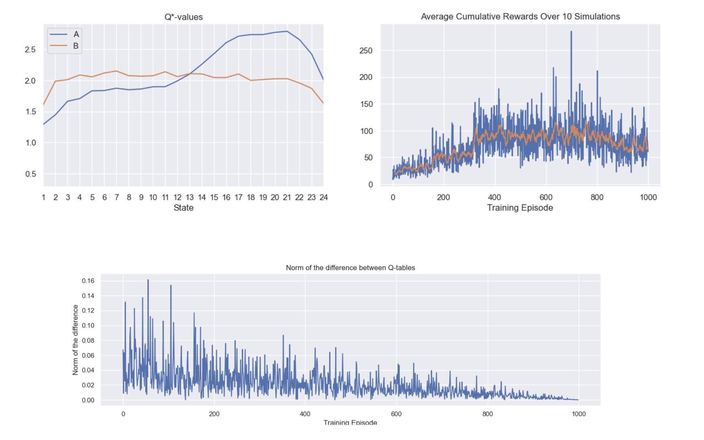

# 🤖 Reinforcement Learning 

The aim of this project is to apply Reinforcement Learning to learn optimal policy for a frog jumping on lilypads.

## Screenshots

## Authors

- [@Francois Porcher](https://github.com/FrancoisPorcher)

## 🔗 Links

